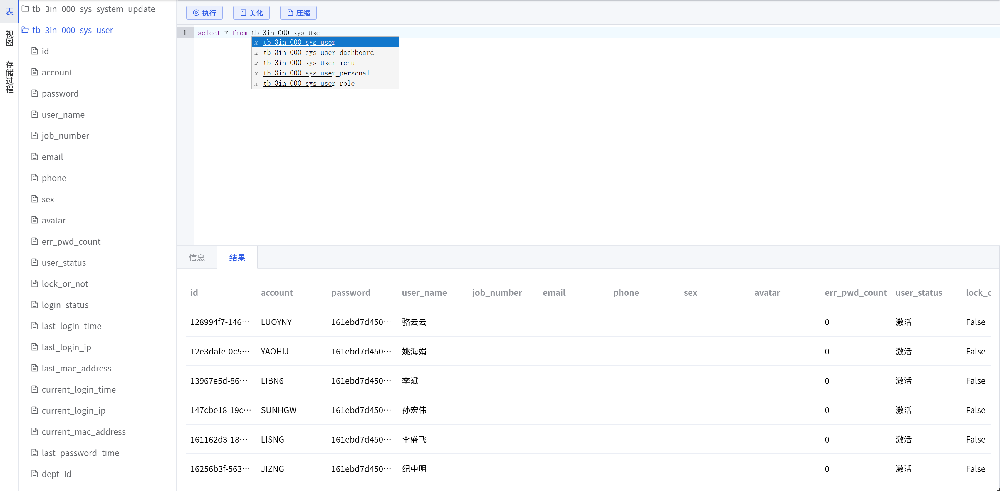

### 安装

```bash
npm install @xm-dev/sql-viewer-vue3

# 你的项目需有 vue3 和 element plus
npm install vue element-plus @element-plus/icons-vue
```

### 全局注册

`main.js`

```js
import { createApp } from 'vue';
import App from './App.vue';
const app = createApp(App);

// 引入组件并注册
import SqlViewer from '@xm-dev/sql-viewer-vue3';
app.use(SqlViewer);

app.mount('#app');
```

`vue`

```vue
<template>
	<SqlViewer />
</template>
```

### 按需引入

`vue`

```vue
<template>
	<SqlViewer />
</template>

<script setup>
	import { SqlViewer } from '@xm-dev/sql-viewer-vue3';
</script>
```

### 页面效果

- 页面效果跟简化版的 `Navicat` 差不多
- 执行结果, 默认是用 el-table-v2, 可以用 <template #table> 换成其他虚拟表格, 比如 `VxeTable`



### 示例代码

```vue
<template>
	<SqlViewer
		v-loading="load"
		:panel="{
			main: { layout: 'horizontal', lazy: false },
			left: { min: '200', size: '300' },
			right: { min: '30%' },
			sub: { layout: 'vertical', lazy: false },
			top: { min: '30%' },
			bottom: { min: '30%' },
		}"
		v-model:tab="tab"
		:tabs="tabs"
		:tree="tree"
		:treeProps="treeProps"
		v-model:sql="sql"
		@run="getRun"
		:tips="tips"
		:info="info"
		:infoType="infoType"
		:result="result"
		:cols="cols"
	>
		<!-- 我更喜欢用VxeTable的虚拟表格, 高级版VxeTable效果更像Navicat -->
		<template #table>
			<div class="VxeTable">
				<vxe-table ref="VxeTableRef" v-bind="vxe_h()" :data="result" align="left">
					<vxe-column type="seq" width="50" fixed="left" />
					<vxe-column :field="v.field" :title="v.title" min-width="120" v-for="v in cols" />
				</vxe-table>
			</div>
		</template>
	</SqlViewer>
</template>

<script setup>
	defineOptions({ name: 'SQLEditor' });
	const role = 'SQLEditor';
	const Lang = useLang('SQLEditor');
	const Lang2 = useLang('common');

	// 编辑器 ------------------------------------------------------------------------------------------
	import { SqlViewer } from '@xm-dev/sql-viewer-vue3';
	const load = ref(false);

	// 获取数据
	import { GetInfo } from '@/api/dev/sql';
	const tree = ref({});
	const treeProps = ref({
		table: { value: 'name', label: 'name', children: 'column' },
		view: { value: 'name', label: 'name', children: 'column' },
		SP: { value: 'name', label: 'name', children: 'column' },
	});
	const getTabsInfo = async (type, key) => {
		load.value = true;
		const res = await GetInfo({ object_type: type });
		load.value = false;

		if (res.code === 0) tree.value[key] = res?.data || [];
		else XmNotify(res.msg, 'error');
	};

	// LeftArea ------------------------------------------------------------------------------------------
	const tab = ref('table');
	const tabs = computed(() => [
		{ label: '表', name: 'table' },
		{ label: '视图', name: 'view' },
		{ label: '存储过程', name: 'SP' },
	]);

	// TopArea ------------------------------------------------------------------------------------------
	const sql = ref('');
	import { ExecuteSql } from '@/api/dev/sql';
	const getRun = async sql => {
		if (!sql.trim()) return XmNotify('请输入SQL语句', 'warning');
		clear();

		load.value = true;
		const res = await ExecuteSql({ sql });
		load.value = false;

		if (res.code === 0) {
			info.value = `${res?.data?.length || 0} 条记录`;
			infoType.value = 'success';
			result.value = res?.data || [];
		} else {
			XmNotify(res.msg, 'error');
			info.value = res.msg;
			infoType.value = 'error';
			result.value = [];
		}

		if (result.value.length > 0) {
			const obj = { ...result.value[0] };

			for (const v in obj) {
				if (['_X_ROW_KEY'].includes(v)) continue;
				cols.value.push({ field: v, title: v, key: v, dataKey: v, width: 120, align: 'left' });
			}
		}
	};

	// BottomArea ------------------------------------------------------------------------------------------
	const info = ref('');
	const infoType = ref('');
	const result = ref([]);
	const cols = ref([]);
	const clear = () => {
		info.value = '';
		infoType.value = '';
		result.value = [];
		cols.value = [];
	};
	// Vxe 预设配置
	const vxe_h = () => {
		const h_def = XmVxe.h_def();
		const h_copy = XmVxe.h_copy();
		const vxe_h = { ...h_def, ...h_copy };
		return vxe_h;
	};

	// Tips ------------------------------------------------------------------------------------------
	const tips = ref([]);
	const getNames = data => {
		const names = new Set();
		Object.values(data).forEach(collection => {
			if (Array.isArray(collection))
				collection.forEach(item => {
					if (item && typeof item === 'object' && 'name' in item) names.add(item.name);
				});
		});
		return Array.from(names);
	};

	// 周期 ------------------------------------------------------------------------------------------
	const init = async () => {
		await getTabsInfo('表', 'table');
		await getTabsInfo('视图', 'view');
		await getTabsInfo('存储过程', 'SP');
		tips.value = getNames(tree.value);
	};
	onMounted(() => init());
</script>

<style lang="scss" scoped>
	.VxeTable {
		height: 100%;
	}
</style>
```

### Props 和 Emits

```vue
const props = defineProps({ // 面板配置 ------------------------------------- panel: { type: Object, default: () => ({}) }, // LeftArea ------------------------------------- tab: { type: String, default: '' }, // 选中的标签页 table | view | function tabs: { type: Array, default: () => null }, tree: { type: Object,
default: () => ({}) }, // 标签页上的树状数据 treeProps: { type: Object, default: () => ({}) }, // TopArea ------------------------------------- sql: { type: String, default: '' }, // 编辑器上的语句 tips: { type: Array, default: () => [] }, // 编辑器补全提示 // BottomArea ------------------------------------- info: {
type: String, default: '' }, // 信息 infoType: { type: String, default: '' }, // 信息类型 success | warning | infoType | info result: { type: Array, default: () => [] }, // 执行结果 cols: { type: Array, default: () => [] }, // 执行结果中筛选出字段列 渲染表格 }); const emits = defineEmits(['update:tab', 'tabChange',
'update:sql', 'run']);
```

##### 面板配置

```vue
// 默认面板配置 { main: { layout: 'horizontal', lazy: false }, left: { min: '200', size: '300' }, right: { min: '30%' }, sub: { layout: 'vertical', lazy: false }, top: { min: '30%' }, bottom: { min: '30%' }, } https://element-plus.org/zh-CN/component/splitter 按需调整版块布局
```

##### 标签页配置

```vue
// 默认标签页配置 [ { label: '表', name: 'table' }, { label: '视图', name: 'view' }, { label: '函数', name: 'function' }, ] 正常就这三种就够了, 不用调
```

### 自定义

想自定义或者查看传参和事件, 直接翻[源码](https://github.com/xiaomu-dev/sql-viewer-vue3)吧.

### 环境

```bash
# 开发此包的环境
node -v		# v25.0.0
npm -v		# 11.6.2

# 示例代码的环境
node -v		# v22.0.0
npm -v		# 10.5.1
pnpm -v		# 10.34.4
```

## ⚠️ 重要使用声明

引用的相关插件,请自行查看对应的协议。
所有违规、违法、侵权使用产生的全部法律责任，均由使用者自行承担，**项目作者不承担任何连带责任与法律责任**。

## 📜 开源协议

[![Apache 2.0][apache-shield]][apache-2.0]

**Copyright (c) 2026 xiaomu-dev**

本项目基于 **Apache License 2.0** 协议开源

### 许可范围

✅ **允许**

- 个人/企业免费学习、研究、自用、商用交付
- 自由修改源码、新增业务逻辑
- 闭源二次开发、私有化部署、打包商用售卖
- 分发、修改、衍生开发，衍生代码可自行选择私有/开源协议

### 强制遵守条款

1. 分发时完整保留本项目 `LICENSE` 协议文件；
2. 所有修改过的源文件内标注改动记录；
3. 保留原版权署名、NOTICE 文件内容，不得抹除原作者信息；
4. 本协议授予配套专利永久免费授权；若使用者以本项目代码起诉原作者专利侵权，其全部使用权自动终止。

### 免责说明

本软件按「现状」分发，无任何明示或隐含担保；使用者使用、改造本项目产生的一切商业损失、安全风险、法律纠纷均由使用者自行承担，原作者不承担任何连带责任。

[apache-2.0]: https://www.apache.org/licenses/LICENSE-2.0
[apache-shield]: https://img.shields.io/badge/license-Apache%202.0-blue.svg
